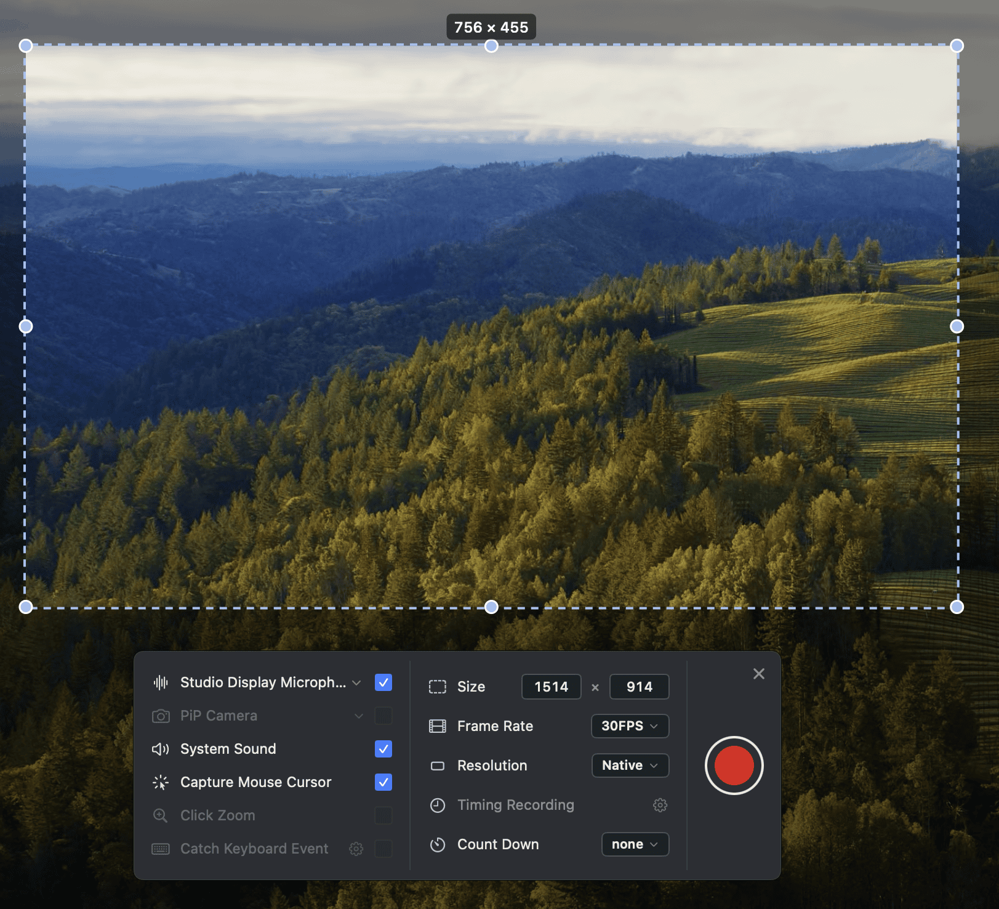

# EggplantRecorder

原生 **macOS 15+** 菜单栏录屏工具 — 全屏、区域或窗口一键录制，停录后即可预览、裁剪、导出。

[English](./README.md)

预编译 DMG 见 **[Releases](https://github.com/uniquejava/EggplantRecorder/releases)** — 推送 `v*` 标签即可自动打包。

<p align="center">
  
</p>

## 功能

- **四种录制** — 全屏 / 区域 / 窗口 / 窗口区域
- **底部参数条** — 麦克风、系统声音、光标、帧率、分辨率、倒计时
- **录制中** — 暂停 / 停止 / 计时（暂停不计入时长）
- **区域与窗口** — 虚线框 + 迷你控制条，不会进成片
- **文件列表** — 停录后预览、播放、编辑裁剪
- **双音轨** — 系统声 + 麦克风分开写入，导出时保留
- **中英界面** — 偏好设置或托盘菜单切换语言（需重启）

录像默认保存在 `~/Movies/EggplantRecorder/`。

## 系统要求

- macOS **15** 或更高
- 首次使用需授权 **屏幕录制**；开麦时还需 **麦克风**  
  （系统设置 → 隐私与安全性）

## 安装

1. 从 [Releases](https://github.com/uniquejava/EggplantRecorder/releases) 下载 `.dmg`，拖到「应用程序」
2. 若 Gatekeeper 拦截：`xattr -cr /Applications/EggplantRecorder.app`
3. 打开应用 → 点菜单栏图标开始用

## 从源码运行

```bash
killall EggplantRecorder 2>/dev/null
xcodebuild -scheme EggplantRecorder -configuration Debug -derivedDataPath build build
open build/Build/Products/Debug/EggplantRecorder.app
```

或 `open EggplantRecorder.xcodeproj` 用 Xcode 运行。

请用上面的 Debug 路径打开，不要用可能过期的 `/Applications/EggplantRecorder.app`。

## 文档

| 文档 | 内容 |
|------|------|
| [docs/product.md](docs/product.md) | 产品流程与验收 |
| [AGENTS.md](AGENTS.md) | 开发交接、构建约定、已知坑 |
| [docs/app-icon.md](docs/app-icon.md) | App 图标说明 |

## 尚未完成

PiP 摄像头、点击放大、键盘叠加、定时开录、Convert / Compress 等仍为占位。
